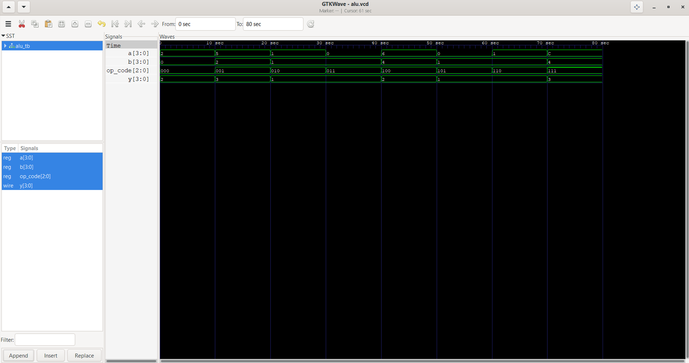

# 4-bit ALU Design in Verilog

## Overview
This project implements a 4-bit Arithmetic Logic Unit (ALU) supporting multiple operations.

## Operations
000 - Addition  
001 - Subtraction  
010 - AND  
011 - OR  
100 - Modulus 
101 - XOR 
110 - XNOR  
111 - DIVISION  

## Tools Used
- Icarus Verilog
- GTKWave

## Simulation
Below is the waveform output verifying ALU functionality:

## Author
Bejgam Nandini
